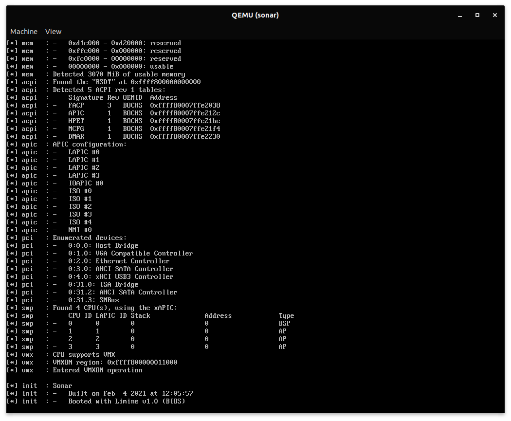

# sonar

Sonar is a 64 bit Type-1 hypervisor aimed to implement kernel hotswapping. It should allow kernels to be easily tested by swapping them out and passing the saved state of the previous kernel to the current one. 



## Project Map

### Source Directory Structure

```
src
├── boot        : code that loads the kernel 
├── drivers     : kernel drivers
├── fs          : filesystems
├── lib         : kernel library routines
├── mm          : kernel memory management
├── net         : networking
├── ospm        : OS power management
├── protos      : boot protocols
├── sec         : OS security
├── sys         : architecture specific code
├── thirdparty  : libraries that need to be compiled with the kernel
└── virt        : virtualization code
```

### Build Directory Structure

The tree below outlines an example structure of the build directory, which contains the binaries for sonar and its dependencies. 

```
build
├── deps
│   ├── bddisasm
│   └── limine
└── kernels
    ├── sonar
    │   └── objects
    └── test
        └── objects
```

### Scripts

```
src
├── gensyms.sh  : generates the kernel's symbol table for debugging
```

## Building

Building sonar is fairly simple. It only depends on a couple tools, most of which are provided by default in a Linux environment. They are as follows:
- git
- make
- mkfs
- clang
- nasm

### Building and Running

There are two possible methods for building:
1. Creating a full hard disk image
2. Creating the standalone Sonar kernel

#### 1. Creating the Full Image

This approach lets one create a full hard drive image, complete with sonar, the limine bootloader, and a test kernel. One can simply copy this image to a drive (flash drive, hard drive, etc) and then boot off this medium. 

Once the image (`sonar.img`) has been created, one can mount it then add/remove files and tweak the limine configuration to suit specific needs. The `sonar.img` file is generated like so: 

```
make
```

The `make` command will automatically clone the dependencies and launch qemu.  

#### 2. Building the Standalone Kernel

Before building the standalone kernel, be sure to clone and compile the dependencies first with

```
make deps
```

If the standalone sonar kernel image needs to be built for whatever reason (for use with a different bootloader, a different sized image, etc), it can be generated with the following command:

```
make sonar-kernel
```

The above command will compile a file called `ksonar.elf` in the sonar build directory, which can then be distributed.

In addition, one can easily rebuild the test kernel only by executing the `test-kernel` rule. This will compile a file called `ktest.elf` in the test kernel build directory, which can then be copied into a hard disk image and loaded by sonar.

```
make test-kernel
```

### Cleaning Up

If, for whatever reason, the codebase needs to be rebuilt, it's often a better idea to only rebuilt the parts that need to be. Because of this, rules are provided to clean subprojects and dispose of remaining object files. They are as follows:

```
make clean-all

make clean-kernels
make clean-deps

make clean-sonar
make clean-test

make clean-limine
make clean-bddisasm
make clean-lai
```

## Dependencies

- [Limine](https://github.com/limine-bootloader/limine) @ v0.6
- [Bddisasm](https://github.com/bitdefender/bddisasm) @ v1.31.2
- [LAI](https://github.com/managarm/lai) @ master

## License

Copyright (c) 2021 Shreyas Lad

Permission is hereby granted, free of charge, to any person obtaining a copy
of this software and associated documentation files (the "Software"), to deal
in the Software without restriction, including without limitation the rights
to use, copy, modify, merge, publish, distribute, sublicense, and/or sell
copies of the Software, and to permit persons to whom the Software is
furnished to do so, subject to the following conditions:

The above copyright notice and this permission notice shall be included in all
copies or substantial portions of the Software.

THE SOFTWARE IS PROVIDED "AS IS", WITHOUT WARRANTY OF ANY KIND, EXPRESS OR
IMPLIED, INCLUDING BUT NOT LIMITED TO THE WARRANTIES OF MERCHANTABILITY,
FITNESS FOR A PARTICULAR PURPOSE AND NONINFRINGEMENT. IN NO EVENT SHALL THE
AUTHORS OR COPYRIGHT HOLDERS BE LIABLE FOR ANY CLAIM, DAMAGES OR OTHER
LIABILITY, WHETHER IN AN ACTION OF CONTRACT, TORT OR OTHERWISE, ARISING FROM,
OUT OF OR IN CONNECTION WITH THE SOFTWARE OR THE USE OR OTHER DEALINGS IN THE
SOFTWARE.